# 🌐 Implantação do WordPress com AWS + Docker

Este projeto tem como objetivo implantar uma aplicação WordPress utilizando serviços da AWS como EC2, RDS, EFS, Auto Scaling e Load Balancer. A implantação é automatizada com um único script `user_data.sh`.

---

## Executar o WordPress localmente (opcional)
Execute um ambiente WordPress local com Docker para validar o funcionamento da aplicação antes de ir para a nuvem.

## Criação da VPC

- Pesquise por VPC.
- Escolha um nome para a VPC.
- Crie um IPv4 CIDR.
- O resto da configuração permanece padrão.

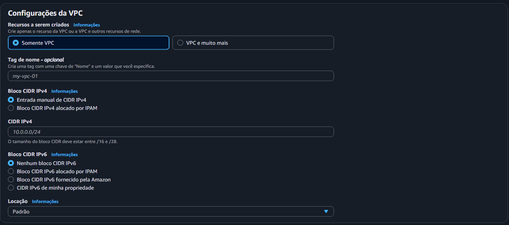

---

## Criação das Sub-redes

- Ainda em VPC, no menu lateral, vá até Sub-redes.
- Crie sub-redes.
- Escolha a VPC que acabou de ser criada.

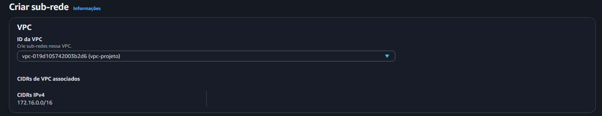

- Escolha o nome da sub-rede de acordo com se ela vai ser pública ou privada, especificando a zona de disponibilidade.
- Escolha a Zona de Disponibilidade. Como serão 4 sub-redes (2 privadas e 2 públicas), utilize duas zonas distintas: a primeira zona `us-east-1a` (pública e privada) e a segunda zona `us-east-1b` (pública e privada).
- O bloco CIDR IPv4 da VPC é automaticamente preenchido com o IPv4 da VPC assim que a VPC é selecionada no início.
- O bloco CIDR IPv4 da sub-rede é ideal usar um IP da mesma família de IP da VPC.
- Visualização geral da configuração de rede completa.

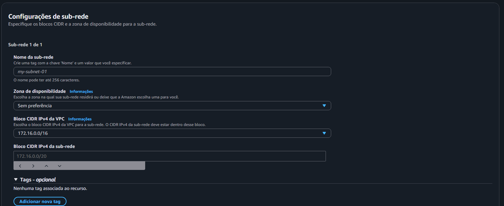


- Visualização geral da configuração de rede
  
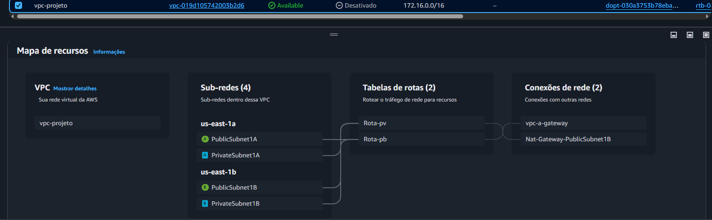

---

## Grupos de Segurança

- Grupo de segurança da EC2.

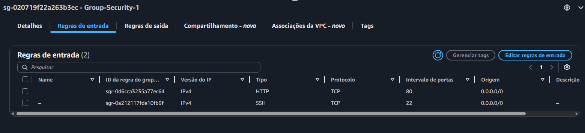

- Grupo de segurança do banco de dados.

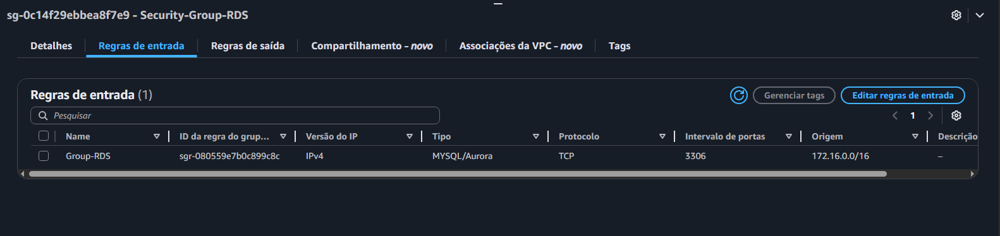

- Grupo de segurança do EFS.

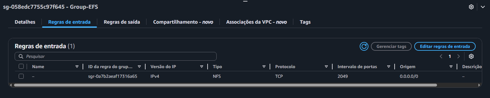

---

## Criar o RDS (banco de dados)

- Pesquise por RDS.
- Vá em criar banco de dados.
- Escolha o método de criação de banco de dados:
  - Criação padrão.
- Em opções do mecanismo, escolha o banco de dados MySQL.

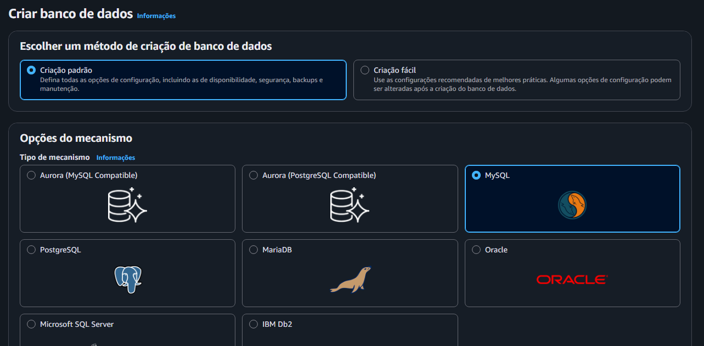

- Na disponibilidade e durabilidade, escolha a implantação de instância de banco de dados Single-AZ (1 instância).

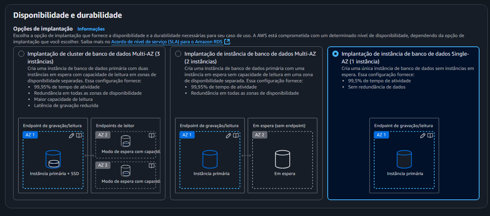

- Em Configurações, escolha o nome da instância de banco de dados.
- Nas configurações de credenciais, escolha o nome do usuário principal e a senha.


- Configuração de instância: selecione classes com capacidade de intermitência (inclui classes T) e escolha a `db.t3.micro`.

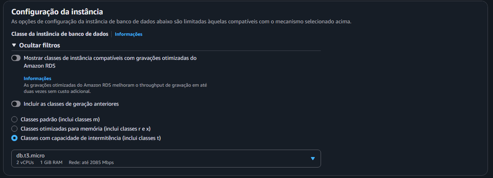

- Conectividade:
  - Escolha conectar-se a um recurso de computação do EC2 e escolha a instância EC2.

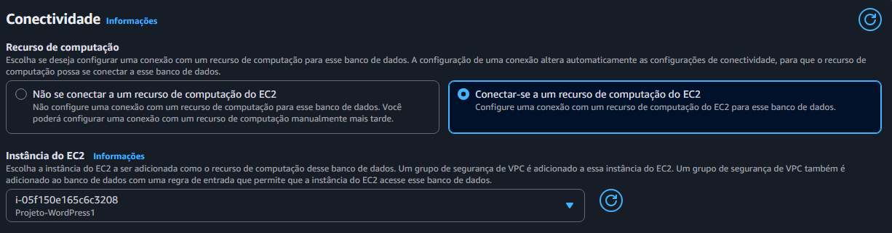

  - Grupo de sub-redes de banco de dados: escolha um já existente.
  - Escolha um grupo de segurança da VPC que está configurado para acessar o banco de dados:
    - Selecione o grupo de segurança do banco de dados ou crie um grupo de segurança para o banco de dados.
  - A zona de disponibilidade é escolhida automaticamente.

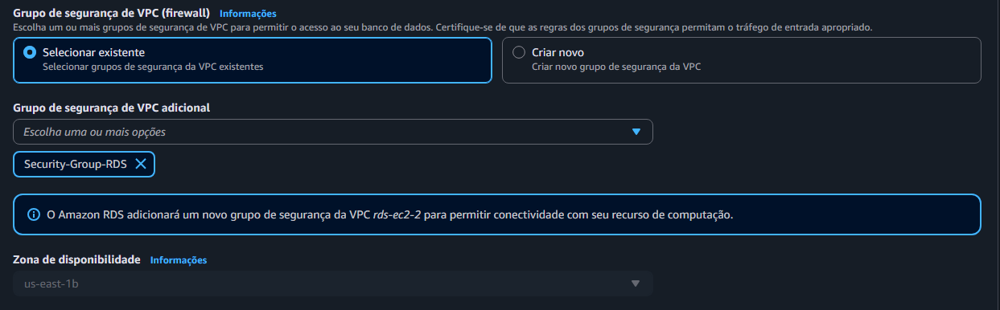

- Criar uma instância **Amazon RDS** (MySQL) configurada com:
  - Nome do banco: `nome do seu banco`
  - Usuário: `usuario`
  - Senha: `senha`
  - Permissão pública ativada (para testes).
  - Executar:

```sql
GRANT ALL PRIVILEGES ON wordpress_db.* TO 'admin'@'%';
FLUSH PRIVILEGES;
```

---

## Criação da EC2

- Pesquise por EC2.
- Vá em executar instância.
- Escolha um nome para a instância.
- Escolha a imagem de aplicação e de sistema operacional:
  - Amazon Linux.

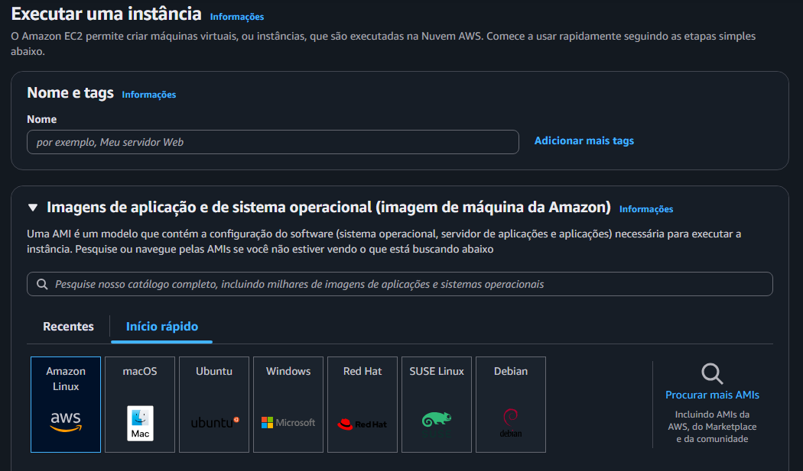

- Tipo de instância: escolha `t2.micro`.

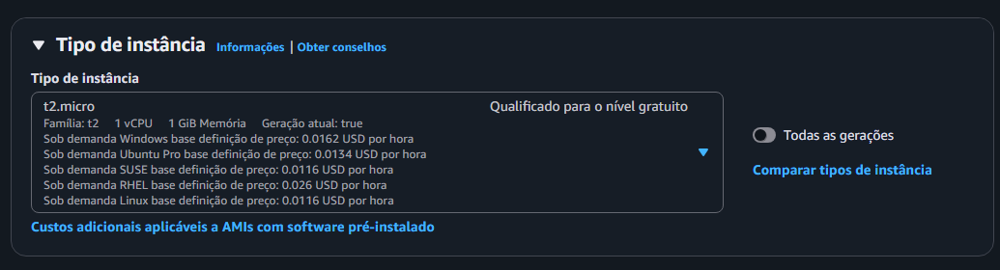

- Par de chaves:
  - Selecione uma chave existente ou crie uma chave em RSA e formato `.pem`.

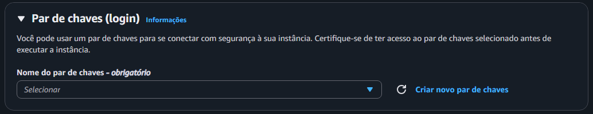

- Escolha RSA em .pem

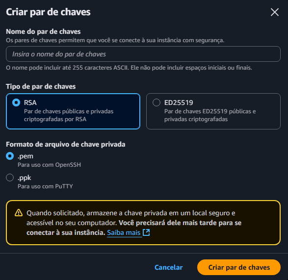

- Configuração de rede:
  - Rede: escolha a VPC que foi criada.
  - Sub-rede: ideal escolher a sub-rede da mesma zona da sub-rede que está no banco de dados.
  - Atribuir IP público automaticamente: habilitar.

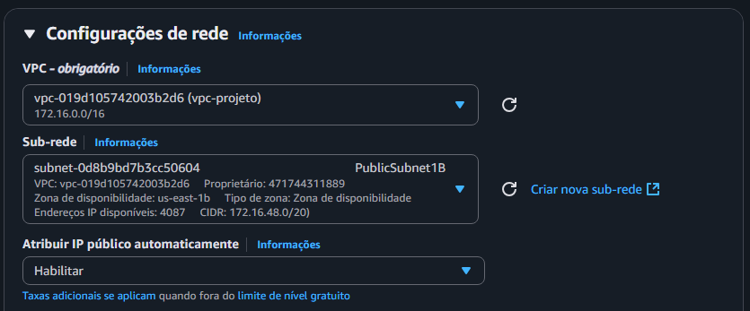

- Firewall (grupo de segurança):
  - Crie um grupo de segurança para EC2 que libere a porta do SSH e HTTP.

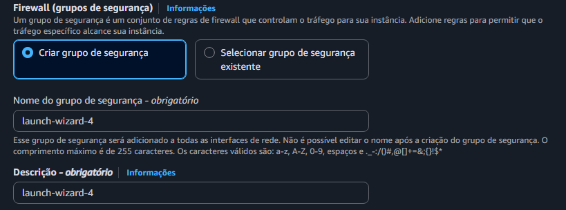

- Configuração para portas:
  - Tipo: SSH
    - Protocolo: TCP
    - Intervalos de portas: 22
    - Tipo de origem: qualquer lugar
    - Origem: `0.0.0.0/0`
  
  - Tipo: HTTP
    - Protocolo: TCP
    - Intervalo de portas: 80
    - Tipo de origem: qualquer lugar
    - Origem: `0.0.0.0/0`.

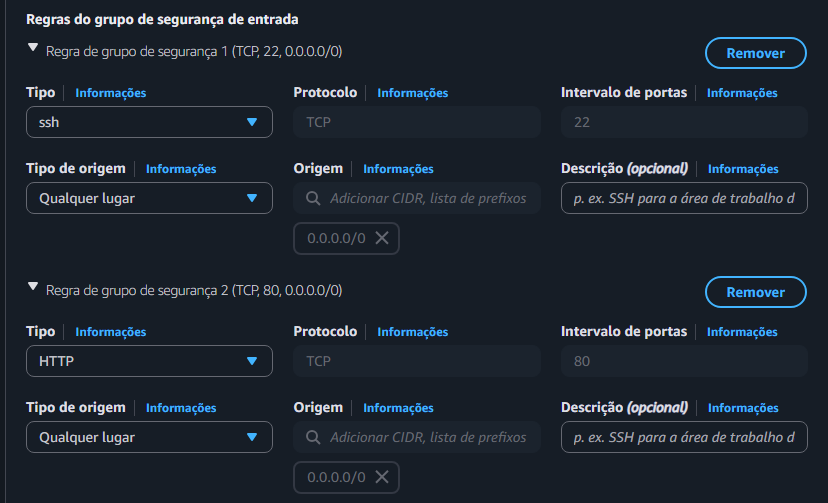

---

# Instalar manualmente o WordPress conectado ao banco de dados

## 📋 Pré-requisitos

- Instância EC2 (Amazon Linux 2023) criada e em execução.
- Banco de dados RDS MySQL criado e acessível.
- EC2 e RDS na mesma VPC (ou roteamento configurado).
- Porta **80** liberada no Security Group da EC2.
- Porta **3306** liberada no Security Group do RDS para a EC2.

## Acesse a EC2 via SSH no terminal.

- Selecione a EC2 e vá em conectar. Na próxima tela que aparecer, clique em conectar.

## Instalar Docker e Docker Compose:

```bash
# Atualizar sistema
sudo dnf update -y

# Instalar Docker
sudo dnf install -y docker
sudo systemctl start docker
sudo systemctl enable docker
sudo usermod -aG docker ec2-user

# Instalar Docker Compose
sudo curl -L "https://github.com/docker/compose/releases/latest/download/docker-compose-$(uname -s)-$(uname -m)" -o /usr/local/bin/docker-compose
sudo chmod +x /usr/local/bin/docker-compose
sudo ln -s /usr/local/bin/docker-compose /usr/bin/docker-compose
```

## Criar as pastas do projeto

```bash
mkdir wordpress-rds
cd wordpress-rds
```

## Criar o arquivo `docker-compose.yml`

```bash
nano docker-compose.yml
```

```yaml
version: '3.8'

services:
  wordpress:
    image: wordpress:latest
    container_name: wordpress
    restart: always
    ports:
      - "80:80"
    environment:
      WORDPRESS_DB_HOST: Seu Endpoint do RDS
      WORDPRESS_DB_USER: SEU_USUÁRIO
      WORDPRESS_DB_PASSWORD: SUA_SENHA_DO_BANCO
      WORDPRESS_DB_NAME: NOME_DO_SEU_BANCO
    volumes:
      - wordpress_data:/var/www/html

volumes:
  wordpress_data:
```

## Subir o WordPress

```bash
docker-compose up -d
```

- Acessar a aplicação: `http://SEU_IP_PUBLICO_EC2`.

---

## Criação do EFS

- Pesquise por EFS.
- Clique em criar sistemas de arquivos.
- Clique em personalizar.
- Configurações do sistema de arquivos:
  - Escolha um nome.
  - Vá para próximo.

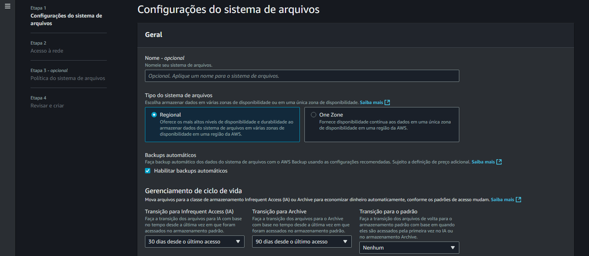

- Acesso à rede:
  - Selecione a VPC criada que contém a EC2.
  - Em Zona de Disponibilidade, escolha `us-east-1a`.
  - ID da sub-rede privada `us-east-1a`.
  - Selecione o grupo de segurança do EFS.
  - Repita o mesmo procedimento para a zona `us-east-1b`.

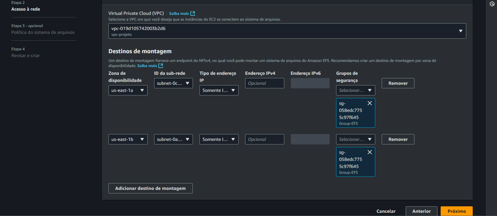

- Vá para próximo 2x.
- Revise se as configurações estão corretas e crie.
## Criar uma nova EC2 com User Data

- Pesquise por EC2.
- Executar instâncias.
- Abaixo da configuração de armazenamento, clique em detalhes avançados.
- Lá no final, procure por Dados do usuário e coloque o script acima.

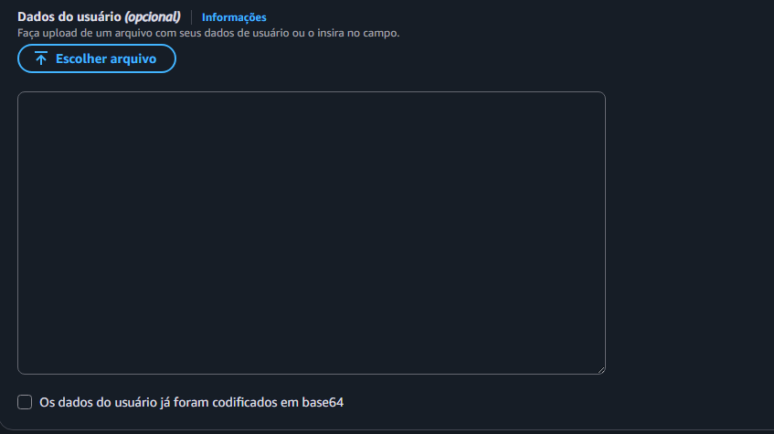

## Acessar a aplicação WordPress

Após inicializar a EC2, acessar via navegador: `http://<IP-PÚBLICO-DA-EC2>`.

---

## Criação do Target Group

- Pesquise por EC2. No menu lateral, no final, em balanceamento de carga, clique em grupos de destino (target group).
- Criar um grupo de destino.
- Tipo de destino: Instância.
- Nome: `Target-group-WordPress`.
- Protocolo: HTTP.
- Porta: 80.
- VPC: Mesma VPC das instâncias EC2.
- Verificação de integridade:
  - Protocolo: HTTP.
  - Caminho: `/`.
  - Intervalo entre verificações: 30 segundos.
  - Tempo limite: 5 segundos.
  - Falhas consecutivas para marcar como inativo: 2.
  - Êxitos consecutivos para marcar como ativo: 2.

---

## Criação do Load Balancer

- Nome: `Balanceador-Carga-Projeto`.
- Tipo: Application Load Balancer (ALB).
- Esquema: Internet-facing.
- Listeners:
  - Porta 80 (HTTP) direcionando para o `Target-group-WordPress`.
  - Zonas de disponibilidade e sub-redes:
    - Sub-redes públicas:
      - `subnet-0d8b9bd7b3cc50604` (PublicSubnet1B).
      - `subnet-XXXXXX` (PublicSubnet1A).

- Grupo de segurança:
  - Porta 80 liberada para todos (`0.0.0.0/0`).
  - Para o tráfego externo entrar.

---

## Criação do Auto Scaling Group

- Nome do grupo: `AutoScaling-Projeto`.
- Modelo de execução: `Template-WP`.
- Sub-redes: Sub-redes privadas:
  - `subnet-0cf37d4f79f9aaeb9` (PrivateSubnet1A).
  - `subnet-0a4eb095a0b0deb12` (PrivateSubnet1B).
- Capacidade desejada: 2 instâncias.
- Capacidade mínima: 2.
- Capacidade máxima: 4.
- Vinculado ao Target Group: `Target-group-WordPress`.
- Balanceador de carga: `Balanceador-Carga-Projeto`.
- Política de substituição: nenhuma.
- Monitoramento de integridade: tipo EC2.
- Tempo de tolerância de verificação de integridade: 300s.

---

## Sub-redes e NAT Gateway

As instâncias estão em sub-redes privadas. Para permitir acesso à internet para atualizações e download de pacotes (via script):

- NAT Gateway:
  - Criado na sub-rede pública: `PublicSubnet1B`.
  - Associado a um Elastic IP.
  - Adicionada rota `0.0.0.0/0` na tabela de rotas da sub-rede privada apontando para o NAT Gateway.

---

## Observações Finais

- O EC2 Instance Connect **não funciona** com sub-redes privadas. Para acessar a instância diretamente, seria necessário:
  - Associar Elastic IP manualmente (não recomendado com Auto Scaling).
  - Usar um Bastion Host em sub-rede pública.
- O acesso à aplicação WordPress é feito exclusivamente via Load Balancer.

---

## WordPress rodando na EC2 

- Resultado do WordPress rodando na EC2 que foi criada pelo Auto Scaling Group e com o script do user_data totalmente automatizado.
<br>
<br>

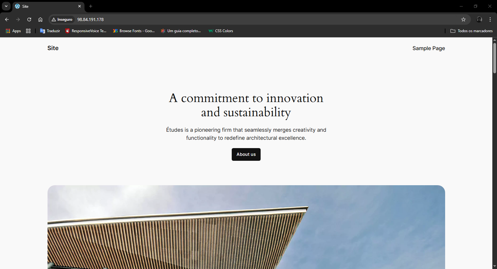

<br>
<br>
<br>

## Criação do CloudWatch (Monitoramento)

## Pré-requisitos

Antes de iniciar, certifique-se de ter os seguintes recursos criados e configurados:

- Um Auto Scaling Group (ASG) configurado.
- Um Application Load Balancer (ALB) com pelo menos um Target Group.
- O Target Group está vinculado ao seu ASG.
- Uma aplicação funcional nas instâncias EC2.

## Adicionar Política de Escalonamento por Requisições

1. Dentro do ASG, acesse a aba "Automatic scaling".
2. Clique em Add policy.
3. Escolha o tipo de política: Target tracking scaling policy.
4. Configure os campos:
   - Nome da política: `EscalonamentoPorRequisicoes`.
   - Tipo de métrica: Application Load Balancer request count per target.
   - Target value: 100 (número de requisições por instância por minuto).
   - Target Group: selecione o mesmo do seu ALB.

> 🔔 Isso criará automaticamente dois alarmes no CloudWatch (AlarmHigh e AlarmLow).

---

## Verificar os Alarmes no CloudWatch

1. Acesse o serviço CloudWatch > Alarmes.
2. Verifique os alarmes gerados:
   - `TargetTracking-AutoScaling-...-AlarmHigh`: escala para cima quando `RequestCountPerTarget > 100`.
   - `TargetTracking-AutoScaling-...-AlarmLow`: escala para baixo quando a métrica cai.

## CloudWatch criado 
<br>
<br>

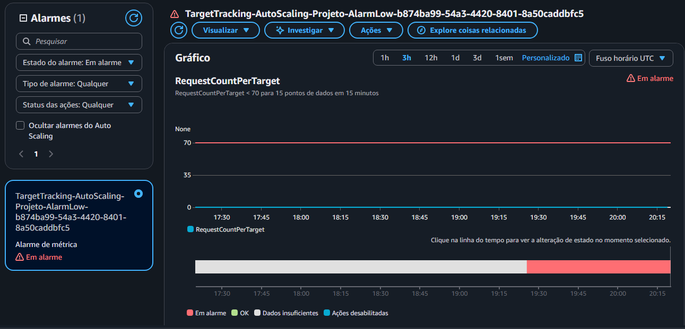

---

***Desenvolvido por Sabrina***
